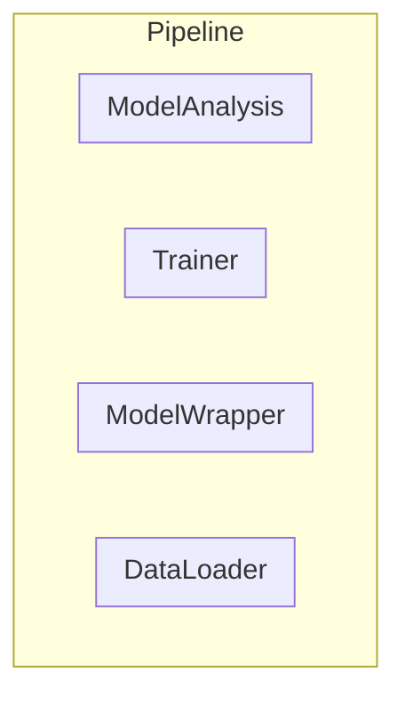

[](https://www.python.org/downloads/release/python-370/)
[](https://www.python.org/downloads/release/python-380/)
[](https://github.com/tiepvupsu/tabml/actions/workflows/python-package.yml)
[](https://codecov.io/gh/tiepvupsu/tabml)

# Machine Learning pipeline for Tabular data

## Setup

### Add path to this repo

Add the following lines to your shell config file (`~/.bashrc`, `~/.zshrc` or shell of
your choice):

```bash
export TABML=<local_path_to_this_git_repo>
alias 2tabml='cd $TABML; source bashrc; source tabml_env/bin/activate; python3 setup.py install'
```

### Create the environment

```bash
cd $TABML
python3 -m venv tabml_env
source tabml_env/bin/activate
pip3 install -r requirements.txt
```

Setup [pre-commit](https://pre-commit.com/) to auto format code when creating a git
commit:
```
pre-commit install
```

### Install and build/update proto

Note: do this only if you update protos.

```
apt install -y protobuf-compiler
tabml_build_proto
```

### Check that everthing is working

by running test

```
2tabml
python3 -m pytest ./tests ./examples
```

## Main components



Each pipeline is controled by a `tabml.pipelines.BasePipeline` instance. There are
three main components in each pipeline:

1.  **DataLoader** for cleaning, preprocessing, engineering features. This class also
    provides methods to get training, validation and submission datasets which are
    later fed into model training, validation and prediction.

2.  **ModelWrapper** for model definition, loading model and making prediction for
    evaluation or submission.

3.  **Trainer** for training model with data being generated by DataLoader. This
    component is also responsible for saving model during/after training.

4.  **ModelAnalysis** for analyzing model performance on different slices of data by
    different metrics.
    
    
