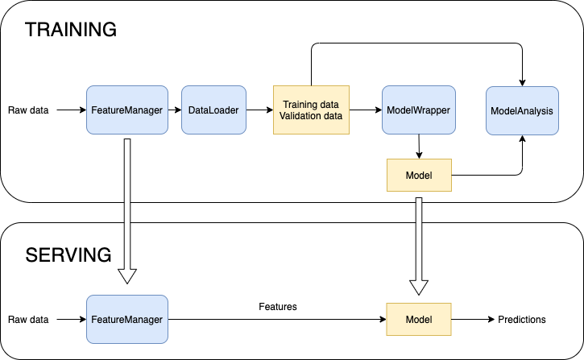

# TabML: a Machine Learning pipeline for tabular data

[](https://www.python.org/downloads/release/python-370/)
[](https://www.python.org/downloads/release/python-380/)
[](https://github.com/tiepvupsu/tabml/actions/workflows/python-package.yml)
[](https://codecov.io/gh/tiepvupsu/tabml)

- [TabML: a Machine Learning pipeline for tabular data](#tabml-a-machine-learning-pipeline-for-tabular-data)
  - [Introduction](#introduction)
  - [Installation](#installation)
  - [Main components](#main-components)
  - [Examples](#examples)
  - [Setup for development](#setup-for-development)
    - [Add path to this repo](#add-path-to-this-repo)
    - [Create the environment](#create-the-environment)
    - [Check that everthing is working](#check-that-everthing-is-working)

## Introduction

This is an active project that aims to create a general machine learning framework for working with tabular data.

Key features:

- One of the most important tasks in working with tabular data is to hanlde feature extraction. TabML allow users to define multiple features isolatedly without worrying about other features. This helps reduce coding conflicts if your team have multiple members simultaneously developing different features. In addition, if one feature needs to be updated, unrelated features could be untouched. In this way, the computating cost is relatively small (compared with running a pipeline to re-generate all other features).

- Parameters are specified in a config file as a protobuf file. This config file is automatically saved into an experiment folder after each training for the reproducibility purpose.

- TabML is integreated with [MLflow](https://mlflow.org/) which allows users to keep track all model parameters and metrics.

- Support multiple ML packages for tabular data:
  - [x] [LightGBM](https://lightgbm.readthedocs.io/en/latest/)
  - [x] [XGBoost](https://xgboost.readthedocs.io/en/latest/)
  - [x] [CatBoost](https://catboost.ai/)
  - [ ] Scikit-learn
  - [ ] Keras
  - [ ] Pytorch
  - [ ] TabNet
  - [ ] ...

## Installation

```shell
pip install tabml
```

## Main components



In TRAINING step,

1. The **FeatureManager** class is responsible for loading raw data and engineering it into relavent features for model training and analysis. If a `fit` step, e.g. imputation, is required for a feature, the fitted parameters will be stored for using later in the `transform` step. One such usage is in the serving step when there is only `transform` step. For each project, there is one `feature_manager.py` file which specifies how each feature is computed ([example](https://github.com/tiepvupsu/tabml/blob/master/examples/titanic/feature_manager.py)). The computation order as well as feature dependencies are specified in a yaml config file ([example](https://github.com/tiepvupsu/tabml/blob/master/examples/titanic/configs/feature_config.yaml)).

2. The **DataLoader** loads training and validation data for model training and analysis. In a typical project, tabml already takes care of this class, users only need to specify configuration in the pipeline config file ([example](https://github.com/tiepvupsu/tabml/blob/95da6aa7f8947329487ff70f189ce213469ebbf1/examples/titanic/configs/lgbm_config.yaml#L2-L19)). In that file, features and label used for training need to be specified. In addition, a set of boolean features are used as conditions for selecting training and validation data. Only rows in the dataset that meet all training/validation conditions are selected.

3. The **ModelWrapper** class defines the model, how to train it and other methods for loading the model and making predictions.

4. The **ModelAnalysis** analyzes the model on different metrics at user-defined dimensions. Analyzing metrics at different slices of data could determine if the trained model is biased to some feature value or any slice of data that model performance could be improved.

In SERVING step, raw data is fed into the *fitted* FeatureManager to get the transfomed features that the trained model could use. The model is then making predictions for the transformed features.

## Examples

Please check the [`examples`](https://github.com/tiepvupsu/tabml/tree/master/examples) folder for several example projects. For each project:

```bash
python feature_manager.py  # to generate features
python pipelines.py  # to train the model
```

You can change some parameters in the config file, run `python pipelines.py` again then `mlflow ui` to see information about each run.

In most project, users only need to focus their efforts on designing features. The feature dependecy is defined in a yaml config file and the feature implementation is stored in `feature_manager.py`.

## Setup for development

### Add path to this repo

Add the following lines to your shell config file (`~/.bashrc`, `~/.zshrc` or any shell config file of
your choice):

```shell
export TABML=<local_path_to_this_git_repo>
alias 2tabml='cd $TABML; source bashrc; source tabml_env/bin/activate; python3 setup.py install'
```

### Create the environment

```shell
cd $TABML
python3 -m venv tabml_env
source tabml_env/bin/activate
pip3 install -r requirements.txt
```

Setup [pre-commit](https://pre-commit.com/) to auto format code when creating a git
commit:

```shell
pre-commit install
```

### Check that everthing is working

by running test

```shell
2tabml
python3 -m pytest ./tests ./examples
```

---

If you find a bug or want to request a feature, feel free to create an issue. Any Pull Request would be much appreciated.
